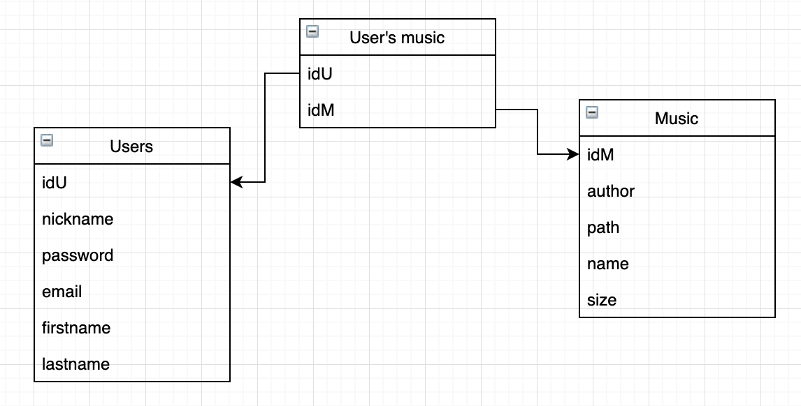
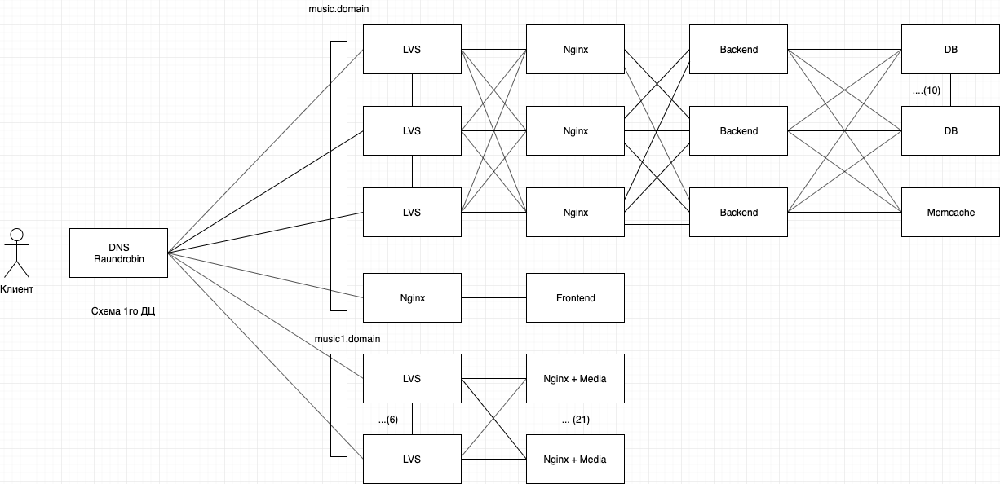

## Highload Service Development

### 1. Тема: Стриминговый аудио сервис
<https://music.yandex.ru/>

### 2. Определение возможного диапазона нагрузок подобного проекта

Взяв в расчет данные из [Яндекс.Радара](https://radar.yandex.ru/top_list?thematic=culture%2Cmusic)  за 2019 год, можно сказать, что сервис имеет следующую статистику по пользователям: 
* 25 млн. п./месяц
* 2 млн. п./день
* 187 минут (среднее время проведенное на сервисе)

### 3. Выбор планируемой нагрузки как 30% доля рынка в России

В данный момент средний пользователь сервиса слушает по 187 минут аудиоконтента в день, среднее количество пользователей на сервисе за день состовляет 2 миллиона. Из этого можно сделать вывод, что:

Одна минута песни в максимальном качетсве весит: 

Берем по максимуму 320(битрейт) * 60(сек) = 19200 Кбит / 8 = 2400 КБайт ~ 2,344 МБ 

Но тк большая часть музыки передается пользователям с битрейтом 192, то предлагается взять среднюю величину и скачать что это будет являться максимально возможным весом песни. Кроме того сервис может так же регулировать нагрузку на сервера и при необходимости снижать битрейт.

Минимальный вес 192(битрейт) * 60(сек) = 11400 Кбит / 8 = 1425 КБайт ~ 1,391 МБ

Предположем, что у нас в сервисе в среднем имеется 50% музыке с 192 битрейтом и столько же в 320%, а также, что пользователь равновероятно будет слушать и ту и другую музыку имеем (в реальность намного больше доли песен с 192 битрейтом):

Средний вес одной песни: (2,344 + 1,391)/2 ~ 1,867 МБ (1 минута музыки)

Значит средний пользователь скачивает максимольно:

187(минут на сервисе) * 1,867(МБ) = 349,129 МБ аудиоконтента

В среднем за день скачивается с нашего сервиса максимально скачивается:

349.129(МБ) * 2000000(пользователей) = 698 258 000 МБ музыки ~ 666 ТБайт музыки 

С учетом того, что дневной пик = 2,5 * (среднюю нагрузку) имеем:

дневной пик = 2,5 * (2000000/24(Среднее кол-во пользователей в час)) ~ 208 334 человек/час

Нагрузка в дневной пик = 349,129(МБ) * 208334(человек/час) ~ 72 735 441 МБ = 69,365 ТБайт/час = 554,92 Терабит/час

Нагрузка на добавление песен можно не учитывать тк она достаточно мала и не существенна по сравнению с нагрузкой на отдачу мызыки

Для гарантированной работы сервиса при максимальных нагрузках возьмем еще запас по запросом в 30% от пика:

208334(человек/час) * 1.3 * 349,129(МБ) = 94556074 (МБ/час) = 756,449 Терабит/час ~ 756449 Гигабит/час

### 4. Логическая схема базы данных (без выбора СУБД)

### 5. Физическая системы хранения (конкретные СУБД, шардинг, расчет нагрузки, обоснование реализуемости на основе результатов нагрузочного тестирования)
Для раздачи контента нам будет необходимо 3 датацентра. В 2 датацентрах будут находить реплики основного ДЦ

Для БД выберем сервера со следующими характеристиками: 
**4ТБ памяти	32 ядра	2x256Гб SSD	RAID 10**

Для сервися аутефикации будет использоваться:

СУБД: Tarantool (для хранения логина, пароля и никнейма)

Оценим приблизительный необходимый объем памяти на одного пользователя:

**idU** [bigint] (8 байт)
**nickname** [text] (предположим, что среднее значение 16 символов)
**password** [text] (предположим, что среднее значение 16 символов)
**email** [text] (предположим, что среднее значение 16 символов)
**firstname** [text] (предположим, что среднее значение 16 символов)
**lastname** [text] (предположим, что среднее значение 16 символов)

Средний объем памяти занятый под одного юзера: 8 + 16 * 5 = 88 байт

На сервер вместиться с учетом запаса в 60% :

4 * 1024^4 (байты) * 0.4 * 0.95 (коэфф заполнения) / 88 = 18 991 564 479 записей пользователей

Этого объема хватит для наших текущих потребностей сполна, но нам нужно обеспечить достаточное кол-во реплик для раздачи этой информации, а также шардировать для ускорения сервиса.

Нагрузка на отдачу: 2 000 000 * 10 / 86400 * 2.5 * 1.3 ~ 753 rps

Средняя нагрузка на всю систему бэков: 753 rps => такую нагрузку выдержит и 1 сервер на PostreSQL (выдает 25000 rps на чтение). Но поставим 3 сервера

Партиции: БД развибается в группы по 10 000 пользователей по idU  

Шардирование: Нет необходимости

СУБД: Redis (для хранения пользовательских токенов)
Шардирование: Нет необходимости

Для сервисов пользовательской музыки:

СУБД: PostreSQL 

**idU** [bigint] (8 байт)
**idM** [bigint] (8 байт)

Средний объем памяти занятый под одну песню юзера: 8 + 8 = 16 байт

На сервер вместиться с учетом запаса в 60% :

256 * 1024^3 (байты) * 0.4 / (16 * 400 (среднее кол-во песен юзера)) = 17 179 869 (хранение записей пользователей)

Берем 3 сервера аналогично с БД выше

Партиции: БД развибается в группы по 10 000 пользователей по idU 

Шардирование: нет необходимости

Аналогично для User's music history и Users popular music

### 6. Выбор прочих технологий: языки программирования, фреймфорки, протоколы взаимодействия, веб-сервера и т.д. (с обоcнованием выбора)

Языки программирования: 

Для сервисов связанных с музыкой необходимо использовать C/Cpp для получения максимальной скорости

Для сервисов входа и регистрации пользователя:

Бэкенд на Golang

Для сервисов рекомендаций и обработки пользовательской информации:

Python, а также механизмы системы рекомендации. Является наиболее логичным выбором для рекомендательной системы тк написанно много удобных бибилиотек для работы с анализом предпочтений пользовтелей и пр..

### 7. Расчет нагрузки и потребного оборудования

**Нагрузка на фронтенд: **

4 (Мб - средний объем нашего фронтенда) * 270 835 (кол-во пользователей в пик с запасом в 30%) ~ 1 058  Гб / час = 300,942 МБ/с = 2,407536 Гигабита

Выберем сервер: 128Гб памяти	32 ядра	минимальный SATA диск без RAID 10G Ethernet

Кол-во серверов:

2 000 000 * 2 / 86400 * 2.5 * 1.3 = 151 rps (необходимая нагрузка на отдачу фронтенда)

С такой нагрузкой справится и 1 сервер фронтенда на nginx. Но тк мы расчитываем расширяться, то возьмем 3 сервера.

Нагрузка на бэкенд: 

Выберем сервер: 128Гб памяти	32 ядра	минимальный SATA диск без RAID 10G Ethernet

**Кол-во серверов бэкенда:**

2 000 000 * 5 / 86400 * 2.5 * 1.3  = 377 rps => необходим +-10 бэкенд сервер

**Кол-во медиа серверов:**

Размер всех песен:

22 000 000(всего примерно песен) * 1,867 МБ(средний размер минуты) * 3 минуты(средняя длина песни) ~ 118 Терабайт (всего необходимо хранить)

(270 835 (кол-во пользователей в пик с запасом в 30%) * 349,129 (МБ среднее скачивание аудиоконтента)) / (756 449 (МБита/час) * 60 * 60 ) ~ 21 медиа сервер

Возьмем в 3 раза больше серверов, чтобы сделать реплики и разгрузить 1 ДЦ. Те 63 медиа сервера

Выбранный сервер:
4ТБ * 6 разъемов памяти	32 ядра	минимальный SATA диск RAID10 10G Ethernet

Общая вместительность в 1 ДЦ:

21 * 4 * 6 = 504 ТБ

Общая заполненость серверов: 23,42%

**Кол-во БД серверов высчитано в пункте 5.**
 
**Кол-во Nginx серверов:**

Для бэкенда требуется всего 1 сервер
Для фронтенда еще 1
Медиа серверам не нужен отдельный nginx-сервер

Выберем сервер: 256Гб памяти 36 ядра	минимальный SATA диск без RAID 10G Ethernet

Основываясь на [официальной документации](https://www.nginx.com/blog/testing-the-performance-of-nginx-and-nginx-plus-web-servers/) для нашего сервиса этого более чем достаточно, тк при такой конфигурации мы можем выдержать: 10067 новых коннестов в секунду при использовании https. Наше rps будет примерно: 733745, что полнустью покрывает наши потребности и даже есть достаточное пространство для расширения

**Расчет LVS:**

Выберем сервер: 32Гб памяти 36 ядра минимальный SATA диск без RAID 10G Ethernet

Тк нам нужно обеспечивать максимальную доступность, поэтому установим 3 сервера, которые будут работать с бэком.

Тк для медиа надо передавать 211 Терабит трафика, то
необходимо 22 сервера без учета запасных. Но прозапас возьмем 44 сервера.

**Основываясь на расчеты нагрузки требуются следующие сервера:**

|Тип сервера|Кол-во|Конфигурация|
|-----------|------|------------|
|Фронтенд|3|128Гб памяти	32 ядра	минимальный SATA диск без RAID 10G Ethernet|
|Бэкенд|10|128Гб памяти	32 ядра	минимальный SATA диск без RAID 10G Ethernet|
|БД|30|128Гб памяти	32 ядра	минимальный SATA диск без RAID 10G Ethernet|
|Медиа|63|128Гб памяти	32 ядра	минимальный SATA диск без RAID 10G Ethernet|
|SDN|12|128Гб памяти	32 ядра	минимальный SATA диск без RAID 10G Ethernet|
|Nginx|6|256Гб памяти 36 ядра	минимальный SATA диск без RAID 10G Ethernet|
|LVS|141|32Гб памяти 36 ядра минимальный SATA диск без RAID 10G Ethernet|
|Итого: |256|

### 8. Выбор хостинга / облачного провайдера и расположения серверов

Выбран следующий хостинг: https://mchost.ru/

Основные сервера расположены в Москве, а по остально России распределены собственные SDN:

118 ТБ(необходимый объем) / (6*4) (в 1м срвере ТБ) ~ 5 серверов

Возьмем с запасом по 6 серверов на каждый SDN.

Питер: 6 (серверов)
Новосибирск: 6 (серверов)

### 9. Схема балансировки нагрузки (входящего трафика и внутрипроектного, терминация SSL)

### 10. Обеспечение отказоустойчивости

Для обеспечения отказоустойчивости:

* Будет использоваться система мониторинга: grafana+prometeus