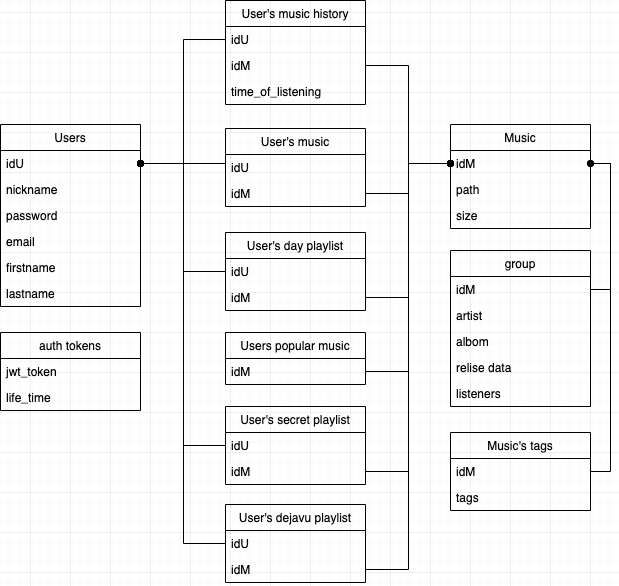

## Highload Service Development

### 1. Тема: Стриминговый аудио сервис
<https://music.yandex.ru/>

### 2. Определение возможного диапазона нагрузок подобного проекта

Взяв в расчет данные из [Яндекс.Радара](https://radar.yandex.ru/top_list?thematic=culture%2Cmusic)  за 2019 год, можно сказать, что сервис имеет следующую статистику по пользователям: 
* 25 млн. п./месяц
* 2 млн. п./день
* 187 минут (среднее время проведенное на сервисе)

### 3. Выбор планируемой нагрузки как 30% доля рынка в России

В данный момент средний пользователь сервиса слушает по 187 минут аудиоконтента в день, среднее количество пользователей на сервисе за день состовляет 2 миллиона. Из этого можно сделать вывод, что:

Одна минута песни в максимальном качетсве весит: 

Берем по максимуму 320(битрейт) * 60(сек) = 19200 Кбит / 8 = 2400 КБайт ~ 2,344 МБ 

Но тк большая часть музыки передается пользователям с битрейтом 192, то предлагается взять среднюю величину и скачать что это будет являться максимально возможным весом песни. Кроме того сервис может так же регулировать нагрузку на сервера и при необходимости снижать битрейт.

Минимальный вес 192(битрейт) * 60(сек) = 11400 Кбит / 8 = 1425 КБайт ~ 1,391 МБ

Предположем, что у нас в сервисе в среднем имеется 50% музыке с 192 битрейтом и столько же в 320%, а также, что пользователь равновероятно будет слушать и ту и другую музыку имеем (в реальность намного больше доли песен с 192 битрейтом):

Средний вес одной песни: (2,344 + 1,391)/2 ~ 1,867 МБ (1 минута музыки)

Значит средний пользователь скачивает максимольно:

187(минут на сервисе) * 1,867(МБ) = 349,129 МБ аудиоконтента

В среднем за день скачивается с нашего сервиса максимально скачивается:

349.129(МБ) * 2000000(пользователей) = 698 258 000 МБ музыки ~ 666 ТБайт музыки 

С учетом того, что дневной пик = 2,5 * (среднюю нагрузку) имеем:

дневной пик = 2,5 * (2000000/24(Среднее кол-во пользователей в час)) ~ 208 334 человек/час

Нагрузка в дневной пик = 349,129(МБ) * 208334(человек/час) ~ 72 735 441 МБ = 69,365 ТБайт/час = 554,92 Терабит/час

Нагрузка на добавление песен можно не учитывать тк она достаточно мала и не существенна по сравнению с нагрузкой на отдачу мызыки

Для гарантированной работы сервиса при максимальных нагрузках возьмем еще запас по запросом в 30% от пика:

208334(человек/час) * 1.3 * 349,129(МБ) = 94556074 (МБ/час) = 756,449 Терабит/час ~ 756449 Гигабит/час

### 4. Логическая схема базы данных (без выбора СУБД)

### 5. Физическая системы хранения (конкретные СУБД, шардинг, расчет нагрузки, обоснование реализуемости на основе результатов нагрузочного тестирования)
Для раздачи контента нам будет необходимо 3 датацентра. В 2 датацентрах будут находить реплики основного ДЦ

Для БД выберем сервера со следующими характеристиками: 
**64Гб памяти	32 ядра	2x256Гб SSD	RAID 10**

Для сервися аутефикации будет использоваться:

СУБД: Tarantool (для хранения логина, пароля и никнейма)

Оценим приблизительный необходимый объем памяти на одного пользователя:

**idU** [bigint] (8 байт)
**nickname** [text] (предположим, что среднее значение 16 символов)
**password** [text] (предположим, что среднее значение 16 символов)
**email** [text] (предположим, что среднее значение 16 символов)
**firstname** [text] (предположим, что среднее значение 16 символов)
**lastname** [text] (предположим, что среднее значение 16 символов)

Средний объем памяти занятый под одного юзера: 8 + 16 * 5 = 88 байт

На сервер вместиться с учетом запаса в 60% :

256 * 1024^3 (байты) * 0.4 / 88 = 1 249 445 031 записей пользователей

Этого объема хватит для наших текущих потребностей сполна, но нам нужно обеспечить достаточное кол-во реплик для раздачи этой информации, а также шардировать для ускорения сервиса.

Нагрузка на отдачу: 270 835 (кол-во пользователей в пик с запасом в 30%) / 29 000 (среднее rps PostreSQL) = 9,339 ~ 10 (серверов необходимо)

Партиции: БД развибается в группы по 10 000 пользователей по idU  

Шардирование: Будет осуществляться по 10 серверам. Для шардирования берем остаток от деления idU на 10

СУБД: Redis (для хранения пользовательских токенов)
Шардирование: Будет осуществляться по 10 серверам. Для шардирования берем остаток от деления хеш-суммы от ключа на 10

Для сервисов пользовательской музыки:

СУБД: PostreSQL 

**idU** [bigint] (8 байт)
**idM** [bigint] (8 байт)

Средний объем памяти занятый под одну песню юзера: 8 + 8 = 16 байт

На сервер вместиться с учетом запаса в 60% :

256 * 1024^3 (байты) * 0.4 / (16 * 400 (среднее кол-во песен юзера)) = 17 179 869 записей пользователей

Партиции: БД развибается в группы по 10 000 пользователей по idU 

Шардирование: Будет осуществляться по 100 серверам. Для шардирования берем остаток от деления idU на 100

Аналогично для User's music history и Users popular music

### 6. Выбор прочих технологий: языки программирования, фреймфорки, протоколы взаимодействия, веб-сервера и т.д. (с обоcнованием выбора)

Языки программирования: 

Для сервисов связанных с музыкой необходимо использовать C/Cpp для получения максимальной скорости

Для сервисов входа и регистрации пользователя:

Бэкенд на Golang

Для сервисов рекомендаций и обработки пользовательской информации:

Python, а также механизмы системы рекомендации. Является наиболее логичным выбором для рекомендательной системы тк написанно много удобных бибилиотек для работы с анализом предпочтений пользовтелей и пр..

### 7. Расчет нагрузки и потребного оборудования

Нагрузка на фронтенд: 

4 (Мб - средний объем нашего фронтенда) * 270 835 (кол-во пользователей в пик с запасом в 30%) ~ 1 058  Гб 

Основываясь на расчеты нагрузки на БД требуется примерно 